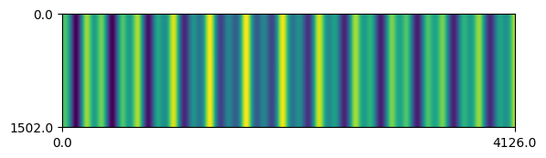
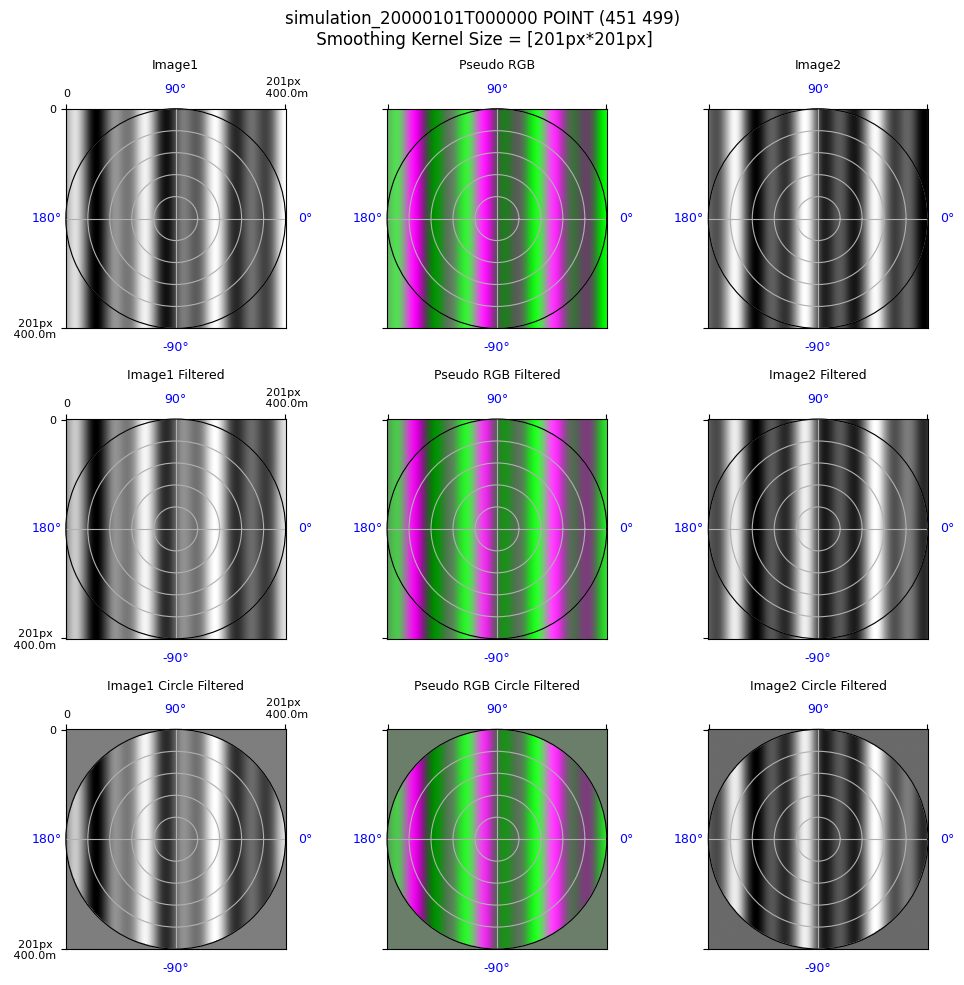
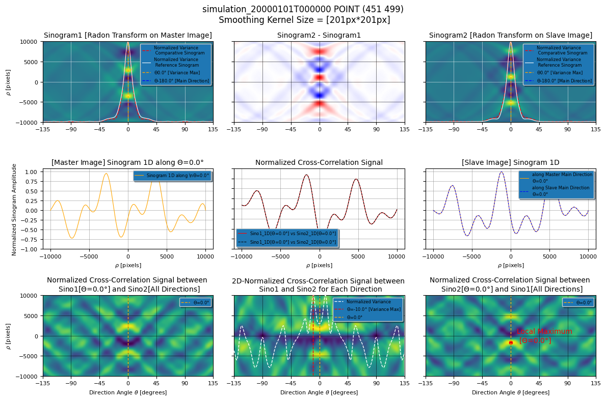

.. code:: ipython3

    %load_ext autoreload
    %autoreload 2

.. parsed-literal::

    The autoreload extension is already loaded. To reload it, use:
      %reload_ext autoreload

.. code:: ipython3

    from pathlib import Path
    from typing import Literal
    
    from matplotlib import pyplot as plt
    from shapely.geometry import Point
    from scipy.interpolate import interp1d
    from scipy.signal import find_peaks
    import numpy as np
    
    from s2shores.bathy_debug.spatial_correlation_bathy_estimator_debug import SpatialCorrelationBathyEstimatorDebug
    from s2shores.bathy_debug.spatial_correlation_wave_fields_display import (
        build_sinograms_spatial_correlation,
        build_waves_images_spatial_correl,
    )
    
    from s2shores.bathy_physics import celerity_offshore, period_offshore, wavelength_offshore
    from s2shores.generic_utils.image_filters import circular_masking
    from s2shores.generic_utils.image_utils import normalized_cross_correlation
    from s2shores.generic_utils.signal_utils import find_period_from_zeros
    from s2shores.generic_utils.symmetric_radon import symmetric_radon
    from s2shores.bathy_debug.display_utils import get_display_title_with_kernel
    from s2shores.bathy_debug.sinogram_display import (
        build_sinogram_display, 
        build_sinogram_difference_display,
        build_sinogram_1D_display_master,
        build_sinogram_1D_cross_correlation,
        build_sinogram_1D_display_slave,
        build_sinogram_2D_cross_correlation,
    )
    from s2shores.global_bathymetry.bathy_config import (
        BathyConfig,
        GlobalEstimatorConfig,
        SpatialCorrelationConfig,
    )
    from s2shores.waves_exceptions import WavesEstimationError, NotExploitableSinogram
    from utils import (
        initialize_sequential_run,
        read_config,
        plot_waves_row,
        build_ortho_sequence,
        plot_whole_image,
    )

In case of a specfic server setup, specify the paths for
~~~~~~~~~~~~~~~~~~~~~~~~~~~~~~~~~~~~~~~~~~~~~~~~~~~~~~~~

.. code:: python

   - os.environ["PROJ_DATA"]
   - os.environ["GDAL_DATA"]
   - os.environ["GDAL_DRIVER_PATH"]
   - os.environ["CONDA_PREFIX"]

.. code:: ipython3

    """
    import os
    os.environ["PROJ_DATA"]="..../share/proj"
    os.environ["GDAL_DATA"]="..../share/gdal"
    os.environ["GDAL_DRIVER_PATH"]="..../lib/gdalplugins"
    os.environ["CONDA_PREFIX"]="..../s2shores"
    """

Coastal Bathymetry Estimation via Spatial Correlation
-----------------------------------------------------

| This notebook implements a bathymetric method using satellite imagery
  based on **spatial correlation** and the **linear relationship between
  water depth and wave kinematics**.
| Wave kinematics are inferred through the **spatial correlation of the
  wave field**, measured from two satellite images acquired within a
  short time interval.
| By leveraging the theory of linear wave dispersion in shallow water,
  bathymetry can be estimated from the wavelength of the waves.

Notebook Objective
------------------

This notebook provides an **experimental and interactive** environment
to: - explore and adjust the key processing steps, - quickly test
different parameters and method variations, - support **iterative
development** of the processing workflow in a prototyping context. ##
Notebook Summary

1. **Preprocess the images**: Apply filters on the images.
2. **Find the direction**: Calculate the main propagation direction of
   the waves.
3. **Compute the Radon transforms**: Compute Radon transforms on all
   images.
4. **Compute the spatial correlation**: Compute the spatial correlations
   of the radon transform on the main direction.
5. **Compute the wavelength**: Compute the wavelength of the waves based
   on the period of the spatial correlation.
6. **Compute the delta position**: Compute the depth estimation from the
   wavelength.

.. code:: ipython3

    base_path = Path("../tests/data/products").resolve()
    test_case: Literal["7_4", "8_2"] = "8_2"
    method: Literal["spatial_corr", "spatial_dft", "temporal_corr"] = "spatial_corr"
    
    product_path: Path = base_path / "products" / f"SWASH_{test_case}/testcase_{test_case}.tif"
    config_path: Path = base_path / f"reference_results/debug_pointswash_{method}/wave_bathy_inversion_config.yaml"
    debug_file: Path = base_path / f"debug_points/debug_points_SWASH_{test_case}.yaml"

.. code:: ipython3

    # config = read_config(config_path=config_path)
    
    # OR
    
    config = BathyConfig(
        GLOBAL_ESTIMATOR=GlobalEstimatorConfig(
            WAVE_EST_METHOD="SPATIAL_CORRELATION",
            SELECTED_FRAMES=[10, 13],
            DXP=50,
            DYP=500,
            NKEEP=5,
            WINDOW=400,
            SM_LENGTH=100,
            MIN_D=2,
            MIN_T=3,
            MIN_WAVES_LINEARITY=0.01,
        )
    )

If you want to change any parameter of the configuration, modify the
values of the object ``config`` by overriding the values of the
attributes.

Example:

.. code:: python

   config.parameter = "new_value"

.. code:: ipython3

    bathy_estimator, ortho_bathy_estimator = initialize_sequential_run(
        product_path=product_path,
        config=config,
        delta_time_provider=None,
    )
    
    plt_min = bathy_estimator.local_estimator_params['DEBUG']['PLOT_MIN']
    plt_max = bathy_estimator.local_estimator_params['DEBUG']['PLOT_MAX']

.. parsed-literal::

    /home/geoffrey/miniconda3/envs/env_name/lib/python3.12/site-packages/distributed/node.py:187: UserWarning: Port 8787 is already in use.
    Perhaps you already have a cluster running?
    Hosting the HTTP server on port 44025 instead
      warnings.warn(

.. code:: ipython3

    estimation_point = Point(451.0, 499.0)

.. code:: ipython3

    ortho_sequence = build_ortho_sequence(ortho_bathy_estimator, estimation_point)
    local_estimator = SpatialCorrelationBathyEstimatorDebug(
        estimation_point,
        ortho_sequence,
        bathy_estimator,
    )
    
    if not local_estimator.can_estimate_bathy():
        raise WavesEstimationError("Cannot estimate bathy.")

Preprocess images
-----------------

Modified attributes: - local_estimator.ortho_sequence.<elements>.pixels

.. code:: ipython3

    from s2shores.generic_utils.image_filters import desmooth, detrend
    
    def custom_filter(img, param1, param2):
        """My custom filter."""
        return img
    
    
    if False:
        local_estimator.preprocess_images()
    else:
        preprocessing_filters = [(detrend, [])]
    
        if bathy_estimator.smoothing_requested:
            # FIXME: pixels necessary for smoothing are not taken into account, thus
            # zeros are introduced at the borders of the window.
    
            preprocessing_filters += [
                (desmooth,
                 [bathy_estimator.smoothing_lines_size,
                  bathy_estimator.smoothing_columns_size]),
                # Remove tendency possibly introduced by smoothing, specially on the shore line
                (detrend, []),
                # Add your custom filters here
                # Ex: (custom_filter, [param1, param2])
            ]
    
        
        for image in local_estimator.ortho_sequence:
            filtered_image = image.apply_filters(preprocessing_filters)
            image.pixels = filtered_image.pixels

Display processed images
------------------------

.. code:: ipython3

    if False:
        build_waves_images_spatial_correl(local_estimator)
    else:
        nrows = 3
        ncols = 3
        fig, axs = plt.subplots(nrows=nrows, ncols=ncols, figsize=(10, 10))
        fig.suptitle(get_display_title_with_kernel(local_estimator), fontsize=12)
    
        first_image = local_estimator.ortho_sequence[0]
        second_image = local_estimator.ortho_sequence[1]
    
        # First Plot line = Image1 / pseudoRGB / Image2
        plot_waves_row(fig=fig,
                       axs=axs,
                       row_number=0,
                       pixels1=first_image.original_pixels,
                       resolution1=first_image.resolution,
                       pixels2=second_image.original_pixels, 
                       resolution2=first_image.resolution,
                       nrows=3,
                       ncols=3)
        # Second Plot line = Image1 Filtered / pseudoRGB Filtered/ Image2 Filtered
        plot_waves_row(fig=fig,
                       axs=axs,
                       row_number=1,
                       pixels1=first_image.pixels,
                       resolution1=first_image.resolution,
                       pixels2=second_image.pixels, 
                       resolution2=first_image.resolution,
                       title_suffix=" Filtered",
                       nrows=3,
                       ncols=3)
    
        # Third Plot line = Image1 Circle Filtered / pseudoRGB Circle Filtered/ Image2 Circle Filtered
        plot_waves_row(fig=fig,
                       axs=axs,
                       row_number=2,
                       pixels1=first_image.pixels * first_image.circle_image,
                       resolution1=first_image.resolution,
                       pixels2=second_image.pixels * second_image.circle_image, 
                       resolution2=first_image.resolution,
                       title_suffix=" Circle Filtered",
                       nrows=3,
                       ncols=3)
        plt.tight_layout()

Find direction
--------------

New variables: - estimated_direction

.. code:: ipython3

    if False:
        main_direction = local_estimator.find_direction()
    else:
        # Start: WavesRadon(self.ortho_sequence[0], self.selected_directions)
        image = local_estimator.ortho_sequence[0]
        sampling_frequency = 1. / image.resolution
        selected_directions = local_estimator.selected_directions
    
        pixels = circular_masking(image.pixels.copy())
        radon_transform = symmetric_radon(image=pixels, theta=selected_directions)
    
        waves_radon = {
            direction: radon_transform[:, idx]
            for idx, direction in enumerate(selected_directions)
        }
        # End: WavesRadon
    
    
        # Start: WavesRadon.get_direction_maximum_variance()
    
        # Start: Sinograms.get_sinograms_variances(selected_directions)
        variances = np.empty(len(selected_directions), dtype=np.float64)
        for result_index, direction in enumerate(selected_directions):
            variances[result_index] = float(np.var(waves_radon[direction]))
        # End: Sinograms.get_sinograms_variances
    
        index_max_variance = np.argmax(variances)
        main_direction = selected_directions[index_max_variance]
        # End: WavesRadon.get_direction_maximum_variance
    
    main_direction

.. parsed-literal::

    -180.0

Compute radon transforms
------------------------

New elements: - local_estimator.randon_transforms

.. code:: ipython3

    from s2shores.image_processing.waves_radon import linear_directions
    
    # For debugging, all plotted directions need to be computed
    min_dir = min(plt_min, min(local_estimator.selected_directions))
    max_dir = max(plt_max, max(local_estimator.selected_directions))
    selected_directions = linear_directions(angle_min=min_dir, angle_max=max_dir, angles_step=1)
    
    # Reset radon transforms when cell is re-run
    local_estimator.radon_transforms = []
    
    if False:
        local_estimator.compute_radon_transforms(main_direction)
    else:
        for image in local_estimator.ortho_sequence:
            # Start: WavesRadon(image, np.array([estimated_direction]))
            sampling_frequency = 1. / image.resolution
    
            pixels = circular_masking(image.pixels.copy())
            radon_transform = symmetric_radon(image=pixels, theta=selected_directions)
    
            waves_radon = {
                direction: radon_transform[:, idx]
                for idx, direction in enumerate(selected_directions)
            }
            # End: WavesRadon
            
            # Start: Sinograms.radon_augmentation(self.radon_augmentation_factor)
            radon_augmented = {}
            for direction, values in waves_radon.items():
                current_axis = np.linspace(0, values.size - 1, values.size)
                nb_over_samples = round(((values.size - 1) / local_estimator.radon_augmentation_factor) + 1)
                new_axis = np.linspace(
                    start=0,
                    stop=values.size - 1,
                    num=nb_over_samples,
                )
                interpolating_func = interp1d(current_axis, values, kind='linear', assume_sorted=True)
                radon_augmented[direction] = interpolating_func(new_axis)
            # End: Sinograms.radon_augmentation(self.radon_augmentation_factor)
    
            local_estimator.radon_transforms.append(radon_augmented)

.. code:: ipython3

    if False:
        # Use this when computing radon transforms with the standard method
        build_sinograms_spatial_correlation(local_estimator, main_direction)
    else:
        nrows = 2
        ncols = 3
        fig, axs = plt.subplots(nrows=nrows, ncols=ncols, figsize=(12, 8))
        fig.suptitle(get_display_title_with_kernel(local_estimator), fontsize=12)
        first_image = local_estimator.ortho_sequence[0]
        second_image = local_estimator.ortho_sequence[1]
    
        arrows = [(main_direction, np.shape(first_image.original_pixels)[0])]
    
        # First Plot line = Image1 Circle Filtered / pseudoRGB Circle Filtered/ Image2 Circle Filtered
        plot_waves_row(
            fig=fig,
            axs=axs,
            row_number=0,
            pixels1=first_image.pixels * first_image.circle_image,
            resolution1=first_image.resolution,
            pixels2=second_image.pixels * second_image.circle_image,
            resolution2=first_image.resolution,
            nrows=nrows,
            ncols=ncols,
            title_suffix=" Circle Filtered",
            directions=arrows,
        )
    
        # Second Plot line = Sinogram1 / Sinogram2-Sinogram1 / Sinogram2
        first_radon_transform = local_estimator.radon_transforms[0]
        second_radon_transform = local_estimator.radon_transforms[1]
    
    
        first_iter = next(iter(first_radon_transform.values()))
        nb_samples = first_iter.shape[0]
        
        sinogram1 = np.empty((nb_samples, len(selected_directions)))
        sinogram2 = np.empty((nb_samples, len(selected_directions)))
    
        for index, direction in enumerate(selected_directions):
            sinogram1[:, index] = first_radon_transform[direction]
            sinogram2[:, index] = second_radon_transform[direction]
    
        radon_difference = (
            (sinogram2 / np.abs(sinogram2).max())
            - (sinogram1 / np.abs(sinogram1).max())
        )
    
        build_sinogram_display(
            axes=axs[1, 0],
            title='Sinogram1 [Radon Transform on Master Image]',
            values1=sinogram1,
            directions=selected_directions,
            values2=sinogram2,
            main_theta=main_direction,
            plt_min=plt_min,
            plt_max=plt_max,
        )
        build_sinogram_difference_display(
            axes=axs[1, 1],
            title='Sinogram2 - Sinogram1',
            values=radon_difference,
            directions=selected_directions,
            plt_min=plt_min,
            plt_max=plt_max,
            cmap='bwr',
        )
        build_sinogram_display(
            axes=axs[1, 2],
            title='Sinogram2 [Radon Transform on Slave Image]',
            values1=sinogram2,
            directions=selected_directions,
            values2=sinogram1,
            main_theta=main_direction,
            plt_min=plt_min,
            plt_max=plt_max,
            ordonate=False,
        )
    
        plt.tight_layout()

.. image:: spatial_correlation_files/spatial_correlation_19_0.png

Compute spatial correlation
---------------------------

New elements: - local_estimator.sinograms

New variables: - correlation_signal

.. code:: ipython3

    local_estimator.sinograms = []
    
    if False:
        correlation_signal = local_estimator.compute_spatial_correlation(main_direction)
    else:
        for radon_transform in local_estimator.radon_transforms:
            values = radon_transform[main_direction]
            values *= float(np.var(values))
            local_estimator.sinograms.append(values)
        # TODO: should be independent from 0/1 (for multiple pairs of frames)
        sinogram_1 = local_estimator.sinograms[0]
        sinogram_2 = local_estimator.sinograms[1]
        correl_mode = local_estimator.local_estimator_params['CORRELATION_MODE']
        corr_init = normalized_cross_correlation(sinogram_1, sinogram_2, correl_mode)
        corr_init_ac = normalized_cross_correlation(corr_init, corr_init, correl_mode)
        corr_1 = normalized_cross_correlation(corr_init_ac, sinogram_1, correl_mode)
        corr_2 = normalized_cross_correlation(corr_init_ac, sinogram_2, correl_mode)
        correlation_signal = normalized_cross_correlation(corr_1, corr_2, correl_mode)
    
    correlation_signal

.. parsed-literal::

    array([0.17217606, 0.17246987, 0.17276372, ..., 0.13137046, 0.13173335,
           0.13209611])

.. code:: ipython3

    nrows = 3
    ncols = 3
    fig, axs = plt.subplots(nrows=nrows, ncols=ncols, figsize=(12, 8))
    fig.suptitle(get_display_title_with_kernel(local_estimator), fontsize=12)
    
    
    # First Plot line = Sinogram1 / Sinogram2-Sinogram1 / Sinogram2
    radon_difference = (sinogram2 / np.max(np.abs(sinogram2))) - \
        (sinogram1 / np.max(np.abs(sinogram1)))
    
    build_sinogram_display(
        axes=axs[0, 0],
        title='Sinogram1 [Radon Transform on Master Image]',
        values1=sinogram1,
        directions=selected_directions,
        values2=sinogram2,
        plt_min=plt_min,
        plt_max=plt_max,
        main_theta=main_direction,
        abscissa=False,
    )
    build_sinogram_difference_display(
        axs[0, 1],
        'Sinogram2 - Sinogram1',
        radon_difference,
        selected_directions,
        plt_min,
        plt_max,
        abscissa=False,
        cmap='bwr',
    )
    build_sinogram_display(
        axes=axs[0, 2],
        title='Sinogram2 [Radon Transform on Slave Image]',
        values1=sinogram2,
        directions=selected_directions,
        values2=sinogram1,
        plt_min=plt_min,
        plt_max=plt_max,
        main_theta=main_direction,
        ordonate=False,
        abscissa=False,
    )
    
    # Second Plot line = SINO_1 [1D along estimated direction] / Cross-Correlation Signal /
    # SINO_2 [1D along estimated direction resulting from Image1]
    # Check if the main direction belongs to the plotting interval [plt_min:plt_max]
    if main_direction < plt_min or main_direction > plt_max:
        theta_label = main_direction % (-np.sign(main_direction) * 180.0)
    else:
        theta_label = main_direction
    title_sino1 = '[Master Image] Sinogram 1D along $\\Theta$={:.1f}° '.format(theta_label)
    title_sino2 = '[Slave Image] Sinogram 1D'.format(theta_label)
    correl_mode = local_estimator.global_estimator.local_estimator_params['CORRELATION_MODE']
    
    build_sinogram_1D_display_master(
        axs[1, 0],
        title_sino1,
        sinogram1,
        selected_directions,
        main_direction,
        plt_min,
        plt_max,
    )
    build_sinogram_1D_cross_correlation(
        axs[1, 1],
        'Normalized Cross-Correlation Signal',
        sinogram1,
        selected_directions,
        main_direction,
        sinogram2,
        selected_directions,
        plt_min,
        plt_max,
        correl_mode,
        ordonate=False,
    )
    build_sinogram_1D_display_slave(
        axs[1, 2],
        title_sino2,
        sinogram2,
        selected_directions,
        main_direction,
        plt_min,
        plt_max,
        ordonate=False,
    )
    
    # Third Plot line = Image [2D] Cross correl Sino1[main dir] with Sino2 all directions /
    # Image [2D] of Cross correlation 1D between SINO1 & SINO 2 for each direction /
    # Image [2D] Cross correl Sino2[main dir] with Sino1 all directions
    # Check if the main direction belongs to the plotting interval [plt_min:plt_ramax]
    
    title_cross_correl1 = 'Normalized Cross-Correlation Signal between \n Sino1[$\\Theta$={:.1f}°] and Sino2[All Directions]'.format(
        theta_label)
    title_cross_correl2 = 'Normalized Cross-Correlation Signal between \n Sino2[$\\Theta$={:.1f}°] and Sino1[All Directions]'.format(
        0)
    title_cross_correl_2D = '2D-Normalized Cross-Correlation Signal between \n Sino1 and Sino2 for Each Direction'
    
    build_sinogram_2D_cross_correlation(
        axs[2, 0],
        title_cross_correl1,
        sinogram1,
        selected_directions,
        main_direction,
        sinogram2,
        plt_min,
        plt_max,
        correl_mode,
        choice='one_dir',
        imgtype='master',
    )
    build_sinogram_2D_cross_correlation(
        axs[2, 1],
        title_cross_correl_2D,
        sinogram1,
        selected_directions,
        main_direction,
        sinogram2,
        plt_min,
        plt_max,
        correl_mode,
        choice='all_dir',
        imgtype='master',
        ordonate=False,
    )
    build_sinogram_2D_cross_correlation(
        axs[2, 2],
        title_cross_correl2,
        sinogram2,
        selected_directions,
        main_direction,
        sinogram1,
        plt_min,
        plt_max,
        correl_mode,
        choice='one_dir',
        imgtype='slave',
        ordonate=False,
    )
    
    plt.tight_layout()

Compute wavelength
------------------

Modified attributes: - None

New variables: - wavelength

.. code:: ipython3

    if False:
        wavelength = local_estimator.compute_wavelength(correlation_signal)
    else:
        min_wavelength = wavelength_offshore(
            local_estimator.global_estimator.waves_period_min,
            local_estimator.gravity,
        )
        min_period_unitless = int(min_wavelength / local_estimator.augmented_resolution)
        try:
            # Depending on the input signal, the resulting period is either in space or time (in this case, space)
            period, _ = find_period_from_zeros(correlation_signal, min_period_unitless)
            wavelength = period * local_estimator.augmented_resolution
        except ValueError as excp:
            raise NotExploitableSinogram('Wave length can not be computed from sinogram') from excp
        
    wavelength

.. parsed-literal::

    134.68150021791905

Compute delta position
----------------------

Modified attributes: - None

New variables: - delta_position

.. code:: ipython3

    if False:
        delta_position = local_estimator.compute_delta_position(correlation_signal, wavelength)
    else:
        peaks_pos, _ = find_peaks(correlation_signal)
        if peaks_pos.size == 0:
            raise WavesEstimationError('Unable to find any directional peak')
        argmax_ac = len(correlation_signal) // 2
        relative_distance = (peaks_pos - argmax_ac) * local_estimator.augmented_resolution
    
        celerity_offshore_max = celerity_offshore(
            local_estimator.global_estimator.waves_period_max,
            local_estimator.gravity,
        )
        spatial_shift_offshore_max = celerity_offshore_max * local_estimator.propagation_duration
        spatial_shift_min = min(-spatial_shift_offshore_max, spatial_shift_offshore_max)
        spatial_shift_max = -spatial_shift_min
    
        stroboscopic_factor_offshore = local_estimator.propagation_duration / period_offshore(
            1 / wavelength, local_estimator.gravity)
        
        if abs(stroboscopic_factor_offshore) >= 1:
            # unused for s2
            print('test stroboscopie vrai')
            spatial_shift_offshore_max = (
                local_estimator.local_estimator_params['PEAK_POSITION_MAX_FACTOR']
                * stroboscopic_factor_offshore
                * wavelength
            )
    
        pt_in_range = peaks_pos[np.where(
            (relative_distance >= spatial_shift_min)
            & (relative_distance < spatial_shift_max)
        )]
        if pt_in_range.size == 0:
            raise WavesEstimationError('Unable to find any directional peak')
        argmax = pt_in_range[correlation_signal[pt_in_range].argmax()]
        delta_position = (argmax - argmax_ac) * local_estimator.augmented_resolution
    
    delta_position

.. parsed-literal::

    -38.800000000000004

Save wave field estimation
--------------------------

New elements: - local_estimator.bathymetry_estimations

.. code:: ipython3

    if False:
        local_estimator.save_wave_field_estimation(main_direction, wavelength, delta_position)
    else:
        bathymetry_estimation = local_estimator.create_bathymetry_estimation(main_direction, wavelength)
        bathymetry_estimation.delta_position = delta_position
        local_estimator.bathymetry_estimations.append(bathymetry_estimation)
        
    print(f"Physical: {local_estimator.bathymetry_estimations[0].is_physical()}")
    print(local_estimator.bathymetry_estimations[0])

.. parsed-literal::

    Physical: True
    Geometry:   direction: 0.0° wavelength: 134.68 (m) wavenumber: 0.007425 (m-1)
    Dynamics:   period: 10.41 (s)  celerity: 12.93 (m/s)
    Wave Field Estimation: 
      delta time: 3.000 (s) stroboscopic factor: 0.288 (unitless)
      delta position: 38.80 (m)  delta phase:  1.81 (rd)
    Bathymetry inversion: depth: 23.43 (m)  gamma: 0.798  offshore period:  9.30 (s)  shallow water period: 30.45 (s)  relative period:  0.89  relative wavelength:  1.25  gravity: 9.780 (s) 
    Bathymetry Estimation:  stroboscopic factor low depth: 0.099  stroboscopic factor offshore: 0.323 

