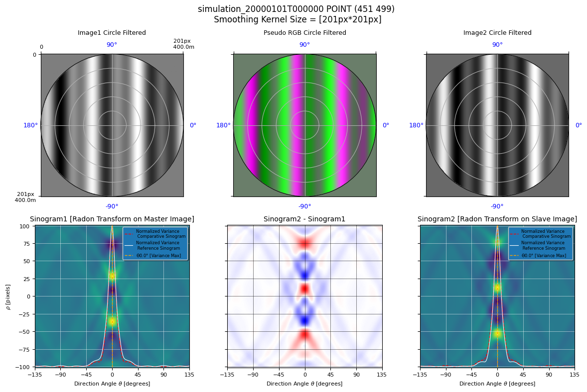
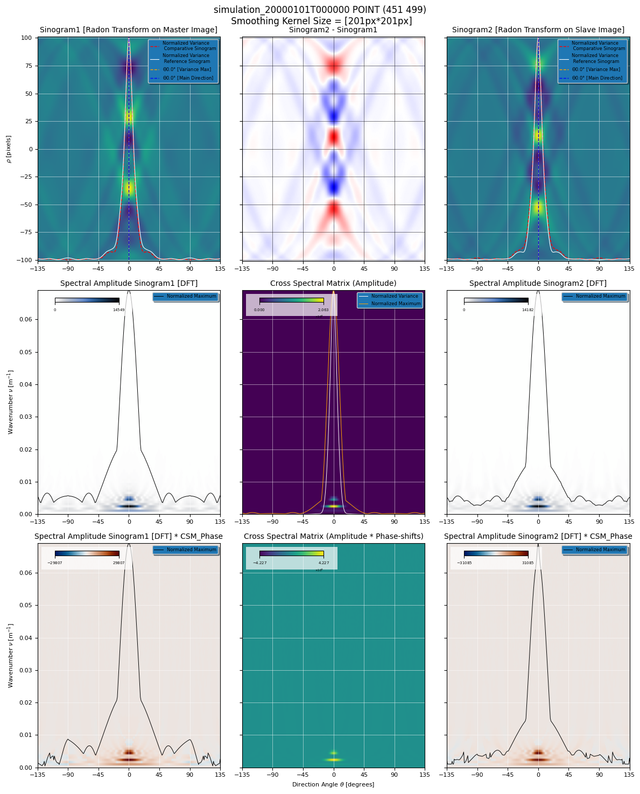
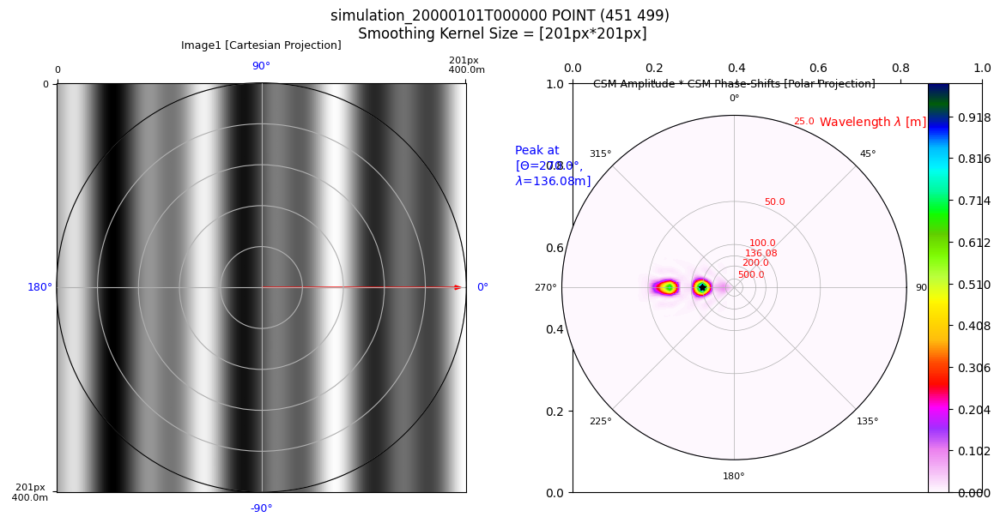

.. code:: ipython3

    %load_ext autoreload
    %autoreload 2

.. code:: ipython3

    from pathlib import Path
    from typing import Literal
    
    from matplotlib import pyplot as plt
    from shapely.geometry import Point
    from scipy.interpolate import interp1d
    from scipy.signal import find_peaks
    import numpy as np
    
    from s2shores.bathy_debug.spatial_dft_bathy_estimator_debug import SpatialDFTBathyEstimatorDebug
    
    from s2shores.bathy_physics import celerity_offshore, period_offshore, wavelength_offshore
    from s2shores.generic_utils.image_filters import circular_masking
    from s2shores.generic_utils.image_utils import normalized_cross_correlation
    from s2shores.generic_utils.signal_utils import find_period_from_zeros
    from s2shores.generic_utils.symmetric_radon import symmetric_radon
    from s2shores.image_processing.waves_radon import linear_directions
    from s2shores.bathy_debug.display_utils import get_display_title_with_kernel
    from s2shores.bathy_debug.sinogram_display import (
        build_sinogram_display, 
        build_sinogram_difference_display,
        build_sinogram_1D_display_master,
        build_sinogram_1D_cross_correlation,
        build_sinogram_1D_display_slave,
        build_sinogram_2D_cross_correlation,
    )
    from s2shores.bathy_debug.spatial_dft_wave_fields_display import build_dft_sinograms_spectral_analysis
    from s2shores.bathy_debug.sinogram_display import (
        build_sinogram_display, 
        build_sinogram_difference_display,
        build_sinogram_spectral_display,
        build_correl_spectrum_matrix)
    
    from s2shores.bathy_debug.spatial_dft_wave_fields_display import build_dft_sinograms
    from s2shores.global_bathymetry.bathy_config import (
        BathyConfig,
        GlobalEstimatorConfig,
        SpatialDFTConfig,
    )
    from s2shores.waves_exceptions import WavesEstimationError, NotExploitableSinogram
    from utils import initialize_sequential_run, read_config, plot_waves_row, build_ortho_sequence

In case of a specfic server setup, specify the paths for
~~~~~~~~~~~~~~~~~~~~~~~~~~~~~~~~~~~~~~~~~~~~~~~~~~~~~~~~

.. code:: python

   - os.environ["PROJ_DATA"]
   - os.environ["GDAL_DATA"]
   - os.environ["GDAL_DRIVER_PATH"]
   - os.environ["CONDA_PREFIX"]

.. code:: ipython3

    """
    import os
    os.environ["PROJ_DATA"]="..../share/proj"
    os.environ["GDAL_DATA"]="..../share/gdal"
    os.environ["GDAL_DRIVER_PATH"]="..../lib/gdalplugins"
    os.environ["CONDA_PREFIX"]="..../s2shores"
    """

Coastal Bathymetry Estimation via Spatial DFT
---------------------------------------------

| This notebook implements a bathymetric method using satellite imagery
  based on **spatial DFT** and the **linear relationship between water
  depth and wave kinematics**.
| Wave kinematics are inferred through the **spatial DFT of the wave
  field**, measured from two satellite images acquired within a short
  time interval.
| By leveraging the theory of linear wave dispersion in shallow water,
  bathymetry can be estimated from the wavelength of the waves.

Notebook Objective
------------------

This notebook provides an **experimental and interactive** environment
to: - explore and adjust the key processing steps, - quickly test
different parameters and method variations, - support **iterative
development** of the processing workflow in a prototyping context.

Notebook Summary
----------------

1. **Preprocess the images**: Apply filters on the images.
2. **Compute the Radon transforms**: Compute Radon transforms on all
   images.
3. **Find the directions**: Calculate the propagation directions of the
   waves.
4. **Prepare refinement**: Filter out and group found directions
   together.
5. **Find spectral peaks**: Compute the interpolated DFTs in each of the
   filtered directions and find the peaks.

.. code:: ipython3

    base_path = Path("../tests/data/products").resolve()
    test_case: Literal["7_4", "8_2"] = "8_2"
    method: Literal["spatial_corr", "spatial_dft", "temporal_corr"] = "spatial_dft"
    
    product_path: Path = base_path / "products" / f"SWASH_{test_case}/testcase_{test_case}.tif"
    config_path: Path = base_path / f"reference_results/debug_pointswash_{method}/wave_bathy_inversion_config.yaml"
    debug_file: Path = base_path / f"debug_points/debug_points_SWASH_{test_case}.yaml"

.. code:: ipython3

    # config = read_config(config_path=config_path)
    
    # OR
    
    config = BathyConfig(
        GLOBAL_ESTIMATOR=GlobalEstimatorConfig(
            WAVE_EST_METHOD="SPATIAL_DFT",
            SELECTED_FRAMES=[10, 13],
            DXP=50,
            DYP=500,
            NKEEP=5,
            WINDOW=400,
            SM_LENGTH=100,
            MIN_D=2,
            MIN_T=3,
            MIN_WAVES_LINEARITY=0.01,
        ),
        SPATIAL_DFT=SpatialDFTConfig(
            PROMINENCE_MAX_PEAK=0.3,
            PROMINENCE_MULTIPLE_PEAKS=0.1,
            UNWRAP_PHASE_SHIFT=False,
            ANGLE_AROUND_PEAK_DIR=10,
            STEP_T=0.05,
        )
    )

If you want to change any parameter of the configuration, modify the
values of the object ``config`` by overriding the values of the
attributes.

Example:

.. code:: python

   config.parameter = "new_value"

.. code:: ipython3

    bathy_estimator, ortho_bathy_estimator = initialize_sequential_run(
        product_path=product_path,
        config=config,
        delta_time_provider=None,
    )
    
    plt_min = bathy_estimator.local_estimator_params['DEBUG']['PLOT_MIN']
    plt_max = bathy_estimator.local_estimator_params['DEBUG']['PLOT_MAX']

.. parsed-literal::

    /home/geoffrey/miniconda3/envs/s2shores_env/lib/python3.12/site-packages/distributed/node.py:187: UserWarning: Port 8787 is already in use.
    Perhaps you already have a cluster running?
    Hosting the HTTP server on port 39321 instead
      warnings.warn(
    /home/geoffrey/miniconda3/envs/s2shores_env/lib/python3.12/site-packages/osgeo/gdal.py:312: FutureWarning: Neither gdal.UseExceptions() nor gdal.DontUseExceptions() has been explicitly called. In GDAL 4.0, exceptions will be enabled by default.
      warnings.warn(

.. image:: spatial_dft_files/spatial_dft_8_1.png

.. code:: ipython3

    estimation_point = Point(451.0, 499.0)

.. code:: ipython3

    ortho_sequence = build_ortho_sequence(ortho_bathy_estimator, estimation_point)
    
    selected_directions = linear_directions(
        angle_min=min(-180, plt_min),
        angle_max=max(180, plt_max),
        angles_step=1,
    )
    
    local_estimator = SpatialDFTBathyEstimatorDebug(
        estimation_point,
        ortho_sequence,
        bathy_estimator,
        selected_directions,
    )
    
    if not local_estimator.can_estimate_bathy():
        raise WavesEstimationError("Cannot estimate bathy.")

Preprocess images
-----------------

Modified attributes: - local_estimator.ortho_sequence.<elements>.pixels

.. code:: ipython3

    from s2shores.generic_utils.image_filters import desmooth, detrend
    
    def custom_filter(img, param1, param2):
        """My custom filter."""
        return img
    
    
    if False:
        local_estimator.preprocess_images()
    else:
        preprocessing_filters = [(detrend, [])]
    
        if bathy_estimator.smoothing_requested:
            # FIXME: pixels necessary for smoothing are not taken into account, thus
            # zeros are introduced at the borders of the window.
    
            preprocessing_filters += [
                (desmooth,
                 [bathy_estimator.smoothing_lines_size,
                  bathy_estimator.smoothing_columns_size]),
                # Remove tendency possibly introduced by smoothing, specially on the shore line
                (detrend, []),
                # Add your custom filters here
                # Ex: (custom_filter, [param1, param2])
            ]
    
        
        for image in local_estimator.ortho_sequence:
            filtered_image = image.apply_filters(preprocessing_filters)
            image.pixels = filtered_image.pixels

Display processed images
------------------------

.. code:: ipython3

    if False:
        build_waves_images_spatial_correl(local_estimator)
    else:
        nrows = 3
        ncols = 3
        fig, axs = plt.subplots(nrows=nrows, ncols=ncols, figsize=(10, 10))
        fig.suptitle(get_display_title_with_kernel(local_estimator), fontsize=12)
    
        first_image = local_estimator.ortho_sequence[0]
        second_image = local_estimator.ortho_sequence[1]
    
        # First Plot line = Image1 / pseudoRGB / Image2
        plot_waves_row(fig=fig,
                       axs=axs,
                       row_number=0,
                       pixels1=first_image.original_pixels,
                       resolution1=first_image.resolution,
                       pixels2=second_image.original_pixels,
                       resolution2=first_image.resolution,
                       nrows=3,
                       ncols=3)
        # Second Plot line = Image1 Filtered / pseudoRGB Filtered/ Image2 Filtered
        plot_waves_row(fig=fig,
                       axs=axs,
                       row_number=1,
                       pixels1=first_image.pixels,
                       resolution1=first_image.resolution,
                       pixels2=second_image.pixels, 
                       resolution2=first_image.resolution,
                       title_suffix=" Filtered",
                       nrows=3,
                       ncols=3)
    
        # Third Plot line = Image1 Circle Filtered / pseudoRGB Circle Filtered/ Image2 Circle Filtered
        plot_waves_row(fig=fig,
                       axs=axs,
                       row_number=2,
                       pixels1=first_image.pixels * first_image.circle_image,
                       resolution1=first_image.resolution,
                       pixels2=second_image.pixels * second_image.circle_image, 
                       resolution2=first_image.resolution,
                       title_suffix=" Circle Filtered",
                       nrows=3,
                       ncols=3)
        plt.tight_layout()

.. image:: spatial_dft_files/spatial_dft_14_0.png

Compute radon transforms
------------------------

New elements: - local_estimator.radon_transforms

.. code:: ipython3

    # Reset radon transforms when cell is re-run
    local_estimator.radon_transforms = []
    sampling_frequencies = []
    
    if False:
        local_estimator.compute_radon_transforms()
        sampling_frequencies = [
            radon_transform.sampling_frequency
            for radon_transform in local_estimator.radon_transforms
        ]
    else:
        for image in local_estimator.ortho_sequence:
            sampling_frequencies.append(1. / image.resolution)
    
            pixels = circular_masking(image.pixels.copy())
            radon_transform = symmetric_radon(image=pixels, theta=selected_directions)
    
            local_estimator.radon_transforms.append({
                direction: radon_transform[:, idx]
                for idx, direction in enumerate(selected_directions)
            })

Plot sinograms
--------------

.. code:: ipython3

    if False:
        # Use this when computing radon transforms with the standard method
        build_dft_sinograms(local_estimator)
    else:
        nrows = 2
        ncols = 3
        fig, axs = plt.subplots(nrows=nrows, ncols=ncols, figsize=(12, 8))
        fig.suptitle(get_display_title_with_kernel(local_estimator), fontsize=12)
        first_image = local_estimator.ortho_sequence[0]
        second_image = local_estimator.ortho_sequence[1]
    
        # First Plot line = Image1 Circle Filtered / pseudoRGB Circle Filtered/ Image2 Circle Filtered
        plot_waves_row(
            fig=fig,
            axs=axs,
            row_number=0,
            pixels1=first_image.pixels * first_image.circle_image,
            resolution1=first_image.resolution,
            pixels2=second_image.pixels * second_image.circle_image,
            resolution2=first_image.resolution,
            nrows=nrows,
            ncols=ncols,
            title_suffix=" Circle Filtered",
        )
    
        # Second Plot line = Sinogram1 / Sinogram2-Sinogram1 / Sinogram2
        first_radon_transform = local_estimator.radon_transforms[0]
        second_radon_transform = local_estimator.radon_transforms[1]
    
    
        first_iter = next(iter(first_radon_transform.values()))
        nb_samples = first_iter.shape[0]
        
        sinogram1 = np.empty((nb_samples, len(selected_directions)))
        sinogram2 = np.empty((nb_samples, len(selected_directions)))
    
        for index, direction in enumerate(selected_directions):
            sinogram1[:, index] = first_radon_transform[direction]
            sinogram2[:, index] = second_radon_transform[direction]
    
        radon_difference = (
            (sinogram2 / np.abs(sinogram2).max())
            - (sinogram1 / np.abs(sinogram1).max())
        )
    
        build_sinogram_display(
            axes=axs[1, 0],
            title='Sinogram1 [Radon Transform on Master Image]',
            values1=sinogram1,
            directions=selected_directions,
            values2=sinogram2,
            plt_min=plt_min,
            plt_max=plt_max,
        )
        build_sinogram_difference_display(
            axes=axs[1, 1],
            title='Sinogram2 - Sinogram1',
            values=radon_difference,
            directions=selected_directions,
            plt_min=plt_min,
            plt_max=plt_max,
            cmap='bwr',
        )
        build_sinogram_display(
            axes=axs[1, 2],
            title='Sinogram2 [Radon Transform on Slave Image]',
            values1=sinogram2,
            directions=selected_directions,
            values2=sinogram1,
            plt_min=plt_min,
            plt_max=plt_max,
            ordonate=False,
        )
    
        plt.tight_layout()

Find directions
---------------

New variables: - peaks

New attributes:

.. code:: python

   - local_estimator.metrics['standard_dft']

.. code:: ipython3

    def dft(values: np.ndarray):
        dft_frequencies = np.fft.fftfreq(values.size)[0:int(np.ceil(values.size / 2))]
        return np.fft.fft(values)[0:dft_frequencies.size]
    
    def get_sinograms_standard_dfts(radon_transform: dict[float, np.ndarray], directions_range: np.ndarray | list = None):
        if directions_range is None:
            directions_range = list(radon_transform.keys())
    
        fft_sino_length = dft(radon_transform[directions_range[0]]).size
        result = np.empty((fft_sino_length, len(directions_range)), dtype=np.complex128)
        for result_index, direction in enumerate(directions_range):
            sinogram = radon_transform[direction]
            result[:, result_index] = dft(sinogram)
        return result
    
    
    if False:
        peaks = local_estimator.find_directions()
    else:
        # TODO: modify directions finding such that only one radon transform is computed (50% gain)
        sino1_fft = get_sinograms_standard_dfts(local_estimator.radon_transforms[0])
        sino2_fft = get_sinograms_standard_dfts(local_estimator.radon_transforms[1])
    
        sinograms_correlation_fft = sino1_fft * np.conj(sino2_fft)
        phase_shift = np.angle(sinograms_correlation_fft)
        spectrum_amplitude = np.abs(sinograms_correlation_fft)
        total_spectrum = np.abs(phase_shift) * spectrum_amplitude
    
        max_heta = np.max(total_spectrum, axis=0)
        total_spectrum_normalized = max_heta / np.max(max_heta)
    
        # TODO: possibly apply symmetry to totalSpecMax_ref in find directions
        peaks, values = find_peaks(total_spectrum_normalized,
                                   prominence=local_estimator.local_estimator_params['PROMINENCE_MAX_PEAK'])
        prominences = values['prominences']
    
        # Start: local_estimator._process_peaks(peaks, prominences)
        print('initial peaks: ', peaks)
        peaks_pairs = []
        for index1 in range(peaks.size - 1):
            for index2 in range(index1 + 1, peaks.size):
                if abs(peaks[index1] - peaks[index2]) == 180:
                    peaks_pairs.append((index1, index2))
                    break
    
        print('peaks_pairs: ', peaks_pairs)
    
        filtered_peaks_dir = []
        # Keep only one direction from each pair, with the greatest prominence
        for index1, index2 in peaks_pairs:
            if abs(prominences[index1] - prominences[index2]) < 100:
                # Prominences almost the same, keep lowest index
                filtered_peaks_dir.append(peaks[index1])
            else:
                if prominences[index1] > prominences[index2]:
                    filtered_peaks_dir.append(peaks[index1])
                else:
                    filtered_peaks_dir.append(peaks[index2])
    
        print('peaks kept from peaks_pairs: ', filtered_peaks_dir)
    
        # Add peaks which do not belong to a pair
        for index in range(peaks.size):
            found_in_pair = False
            for index1, index2 in peaks_pairs:
                if index in (index1, index2):
                    found_in_pair = True
                    break
            if not found_in_pair:
                filtered_peaks_dir.append(peaks[index])
    
        print('final peaks after adding isolated peaks: ', sorted(filtered_peaks_dir))
        peaks = np.array(sorted(filtered_peaks_dir))
    
        if peaks.size == 0:
            raise WavesEstimationError('Unable to find any directional peak')
    
        local_estimator.metrics['standard_dft'] = {
            'sinograms_correlation_fft': sinograms_correlation_fft,
            'total_spectrum': total_spectrum,
            'max_heta': max_heta,
            'total_spectrum_normalized': total_spectrum_normalized,
        }

.. parsed-literal::

    initial peaks:  [180]
    peaks_pairs:  []
    peaks kept from peaks_pairs:  []
    final peaks after adding isolated peaks:  [180]

Prepare refinement
------------------

New variables: - directions

.. code:: ipython3

    if False:
        directions = local_estimator.prepare_refinement(peaks)
    else:
        directions = []
        if peaks.size > 0:
            for peak_index in range(0, peaks.size):
                angles_half_range = local_estimator.local_estimator_params['ANGLE_AROUND_PEAK_DIR']
                direction_index = peaks[peak_index]
                tmp = np.arange(
                    max(direction_index - angles_half_range, 0),
                    min(direction_index + angles_half_range + 1, 360),
                    dtype=np.int64,
                )
                directions_range = np.array(sorted(local_estimator.radon_transforms[0].keys()))[tmp]
                directions.append(directions_range)

Find spectral peaks
-------------------

New attributes:

.. code:: python

   - local_estimator.metrics['kfft']
   - local_estimator.metrics['totSpec']
   - local_estimator.metrics['interpolated_dft']

Modified attributes: - local_estimator.bathymetry_estimations

.. code:: ipython3

    from s2shores.image_processing.waves_sinogram import WavesSinogram
    
    def get_sinograms_interpolated_dfts(sinograms, wavenumbers, sampling_frequency, directions = None):
        if wavenumbers.size == 0:
            raise ValueError('DFT interpolation requires at least 1 frequency')
    
        directions = sinograms.keys() if directions is None else directions
        normalized_frequencies = wavenumbers / sampling_frequency
    
        fft_sino_length = interpolate_dft(sinograms[next(iter(directions))], normalized_frequencies).size
        interpolated_dfts = np.empty((fft_sino_length, len(directions)), dtype=np.complex128)
        for result_index, direction in enumerate(directions):
            interpolated_dfts[:, result_index] = interpolate_dft(sinograms[direction], normalized_frequencies)
    
        return interpolated_dfts, normalized_frequencies
    
    
    def interpolate_dft(sinogram, frequencies):
        if isinstance(sinogram, WavesSinogram):
            sinogram = sinogram.values
        unity_roots = get_unity_roots(frequencies, sinogram.size)
        return np.dot(unity_roots, sinogram)
    
    
    def get_unity_roots(frequencies: np.ndarray, number_of_roots: int) -> np.ndarray:
        roots_indexes = np.arange(number_of_roots)
        working_frequencies = np.expand_dims(frequencies, axis=1)
        return np.exp(-2j * np.pi * working_frequencies * roots_indexes)
    
    # Reset for re-runs
    local_estimator.bathymetry_estimations.clear()
    
    if False:
        local_estimator.find_spectral_peaks(directions)
    else:
        wavenumbers = local_estimator.full_linear_wavenumbers
        sino_ffts: list[tuple[np.ndarray, np.ndarray]] = []
    
        for directions_range in directions:
            # Detailed analysis of the signal for positive phase shifts
            sino1_fft, dft_frequencies1 = get_sinograms_interpolated_dfts(
                local_estimator.radon_transforms[0],
                wavenumbers,
                sampling_frequencies[0],
                directions_range)
            sino2_fft, dft_frequencies2 = get_sinograms_interpolated_dfts(
                local_estimator.radon_transforms[1],
                wavenumbers,
                sampling_frequencies[1],
                directions_range)
            
    
            phase_shift, spectrum_amplitude, sinograms_correlation_fft = \
                local_estimator._cross_correl_spectrum(sino1_fft, sino2_fft)
            total_spectrum = np.abs(phase_shift) * spectrum_amplitude
            max_heta = np.max(total_spectrum, axis=0)
            total_spectrum_normalized = max_heta / np.max(max_heta)
    
            peaks_freq = find_peaks(total_spectrum_normalized,
                                    prominence=local_estimator.local_estimator_params['PROMINENCE_MULTIPLE_PEAKS'])
            peaks_freq = peaks_freq[0]
            peaks_wavenumbers_ind = np.argmax(total_spectrum[:, peaks_freq], axis=0)
    
    
            for index, direction_index in enumerate(peaks_freq):
                estimated_direction = directions_range[direction_index]
                wavenumber_index = peaks_wavenumbers_ind[index]
                estimated_phase_shift = phase_shift[wavenumber_index, direction_index]
    
                peak_sinogram = local_estimator.radon_transforms[0][estimated_direction]
                normalized_frequency = dft_frequencies1[wavenumber_index]
                wavenumber = normalized_frequency * sampling_frequencies[0]
    
                energy = total_spectrum[wavenumber_index, direction_index]
                estimation = local_estimator.save_wave_field_estimation(estimated_direction, wavenumber,
                                                             estimated_phase_shift, energy)
                local_estimator.bathymetry_estimations.append(estimation)
    
    
            local_estimator.metrics['kfft'] = wavenumbers
            local_estimator.metrics['totSpec'] = np.abs(total_spectrum) / np.mean(total_spectrum)
            local_estimator.metrics['interpolated_dft'] = {
                'max_heta': max_heta,
                'total_spectrum_normalized': total_spectrum_normalized,
                'sinograms_correlation_fft': sinograms_correlation_fft,
                'total_spectrum': total_spectrum,
                'phase_shift': phase_shift,
                'directions': directions_range,
            }
    
    
    for estimations in local_estimator.bathymetry_estimations:
        print(estimations)        

.. parsed-literal::

    Geometry:   direction: 0.0° wavelength: 136.08 (m) wavenumber: 0.007349 (m-1)
    Dynamics:   period:  9.21 (s)  celerity: 14.78 (m/s)
    Wave Field Estimation: 
      delta time: 3.000 (s) stroboscopic factor: 0.326 (unitless)
      delta position: 44.34 (m)  delta phase:  2.05 (rd)
    Bathymetry inversion: depth:   inf (m)  gamma: 1.031  offshore period:  9.35 (s)  shallow water period: 30.77 (s)  relative period:  1.02  relative wavelength:  0.97  gravity: 9.780 (s) 
    Bathymetry Estimation:  stroboscopic factor low depth: 0.098  stroboscopic factor offshore: 0.321 
        energy: 423803640.35 (???)  energy ratio: 437043740.55 

Display spectral analysis
-------------------------

.. code:: ipython3

    if False:
        build_dft_sinograms_spectral_analysis(local_estimator)
    else:
        nrows = 3
        ncols = 3
        fig, axs = plt.subplots(nrows=nrows, ncols=ncols, figsize=(12, 15))
        fig.suptitle(get_display_title_with_kernel(local_estimator), fontsize=12)
    
    
        first_radon_transform = local_estimator.radon_transforms[0]
        second_radon_transform = local_estimator.radon_transforms[1]
    
        # First Plot line = Sinogram1 / Sinogram2-Sinogram1 / Sinogram2
        sinogram1 = np.empty((nb_samples, len(selected_directions)))
        sinogram2 = np.empty((nb_samples, len(selected_directions)))
        directions1 = selected_directions
        directions2 = selected_directions
    
        for index, direction in enumerate(selected_directions):
            sinogram1[:, index] = first_radon_transform[direction]
            sinogram2[:, index] = second_radon_transform[direction]
    
        radon_difference = (sinogram2 / np.max(np.abs(sinogram2))) - \
            (sinogram1 / np.max(np.abs(sinogram1)))
    
        # get main direction
        estimations = local_estimator.bathymetry_estimations
        sorted_estimations_args = estimations.argsort_on_attribute(
            local_estimator.final_estimations_sorting)
        main_direction = estimations.get_estimations_attribute('direction')[
            sorted_estimations_args[0]]
    
        build_sinogram_display(
            axs[0, 0], 'Sinogram1 [Radon Transform on Master Image]',
            sinogram1, selected_directions, sinogram2, plt_min, plt_max, main_direction, abscissa=False)
        build_sinogram_difference_display(
            axs[0, 1], 'Sinogram2 - Sinogram1', radon_difference, selected_directions, plt_min, plt_max,
            abscissa=False, cmap='bwr')
        build_sinogram_display(
            axs[0, 2], 'Sinogram2 [Radon Transform on Slave Image]', sinogram2, selected_directions, sinogram1,
            plt_min, plt_max, main_direction, ordonate=False, abscissa=False)
    
    
        # Second Plot line = Spectral Amplitude of Sinogram1 [after DFT] / CSM Amplitude /
        # Spectral Amplitude of Sinogram2 [after DFT]
        sino1_fft = get_sinograms_standard_dfts(first_radon_transform, selected_directions)
        sino2_fft = get_sinograms_standard_dfts(second_radon_transform, selected_directions)        
        kfft = local_estimator._metrics['kfft']
        csm_phase, _, _ = local_estimator._cross_correl_spectrum(sino1_fft, sino2_fft)
    
        build_sinogram_spectral_display(
            axs[1, 0],
            'Spectral Amplitude Sinogram1 [DFT]',
            np.abs(sino1_fft),
            directions1,
            kfft,
            plt_min,
            plt_max,
            abscissa=False,
            cmap='cmc.oslo_r')
        build_correl_spectrum_matrix(
            axs[1, 1],
            local_estimator,
            sino1_fft,
            sino2_fft,
            kfft,
            plt_min,
            plt_max,
            'amplitude',
            'Cross Spectral Matrix (Amplitude)',
            directions=directions1)
        build_sinogram_spectral_display(
            axs[1, 2],
            'Spectral Amplitude Sinogram2 [DFT]',
            np.abs(sino2_fft),
            directions2,
            kfft,
            plt_min,
            plt_max,
            ordonate=False,
            abscissa=False,
            cmap='cmc.oslo_r')
    
        # Third Plot line = Spectral Amplitude of Sinogram1 [after DFT] * CSM Phase /
        # CSM Amplitude * CSM Phase / Spectral Amplitude of Sinogram2 [after DFT] * CSM Phase
    
        build_sinogram_spectral_display(
            axs[2, 0],
            'Spectral Amplitude Sinogram1 [DFT] * CSM_Phase',
            np.abs(sino1_fft) * csm_phase,
            selected_directions,
            kfft,
            plt_min,
            plt_max,
            abscissa=False,
            cmap='cmc.vik')
        build_correl_spectrum_matrix(
            axs[2, 1],
            local_estimator,
            sino1_fft,
            sino2_fft,
            kfft,
            plt_min,
            plt_max,
            'phase',
            'Cross Spectral Matrix (Amplitude * Phase-shifts)',
            directions=directions1)
        build_sinogram_spectral_display(
            axs[2, 2],
            'Spectral Amplitude Sinogram2 [DFT] * CSM_Phase',
            np.abs(sino2_fft) * csm_phase,
            selected_directions,
            kfft,
            plt_min,
            plt_max,
            ordonate=False,
            abscissa=False,
            cmap='cmc.vik')
        plt.tight_layout()

.. parsed-literal::

    /tmp/ipykernel_31300/682541998.py:119: UserWarning: This figure includes Axes that are not compatible with tight_layout, so results might be incorrect.
      plt.tight_layout()

Display polar image
-------------------

.. code:: ipython3

    from s2shores.bathy_debug.spatial_dft_wave_fields_display import build_polar_images_dft
    from s2shores.bathy_debug.waves_image_display import build_display_waves_image
    from s2shores.bathy_debug.polar_display import build_polar_display
    
    if False:
        build_polar_images_dft(local_estimator)
    else:
        nrows = 1
        ncols = 2
        fig, axs = plt.subplots(nrows=nrows, ncols=ncols, figsize=(12, 6))
        fig.suptitle(get_display_title_with_kernel(local_estimator), fontsize=12)
    
        estimations = local_estimator.bathymetry_estimations
        best_estimation_idx = estimations.argsort_on_attribute(
            local_estimator.final_estimations_sorting)[0]
        main_direction = estimations.get_estimations_attribute('direction')[best_estimation_idx]
        ener_max = estimations.get_estimations_attribute('energy_ratio')[best_estimation_idx]
        main_wavelength = estimations.get_estimations_attribute('wavelength')[best_estimation_idx]
        dir_max_from_north = (270 - main_direction) % 360
        arrows = [(wfe.direction, wfe.energy_ratio) for wfe in estimations]
    
        print('ARROWS', arrows)
        first_image = local_estimator.ortho_sequence[0]
    
        # First Plot line = Image1 / pseudoRGB / Image2
        build_display_waves_image(
            fig,
            axs[0],
            'Image1 [Cartesian Projection]',
            first_image.original_pixels,
            resolution=first_image.resolution,
            subplot_pos=[nrows, ncols, 1],
            directions=arrows,
            cmap='gray')
    
        csm_phase, spectrum_amplitude, sinograms_correlation_fft = \
            local_estimator._cross_correl_spectrum(sino1_fft, sino2_fft)
        csm_amplitude = np.abs(sinograms_correlation_fft)
    
        # Retrieve arguments corresponding to the arrow with the maximum energy
        arrow_max = (dir_max_from_north, ener_max, main_wavelength)
    
        print('-->ARROW SIGNING THE MAX ENERGY [DFN, ENERGY, WAVELENGTH]]=', arrow_max)
        polar = csm_amplitude * csm_phase
    
        # set negative values to 0 to avoid mirror display
        polar[polar < 0] = 0
        build_polar_display(
            fig,
            axs[1],
            'CSM Amplitude * CSM Phase-Shifts [Polar Projection]',
            local_estimator,
            polar,
            first_image.resolution,
            dir_max_from_north,
            main_wavelength,
            subplot_pos=[1, 2, 2],
            directions=selected_directions,
            nb_wavenumbers=sinogram1.shape[0])
        plt.tight_layout()

.. parsed-literal::

    ARROWS [(0.0, 437043740.5502732)]
    -->ARROW SIGNING THE MAX ENERGY [DFN, ENERGY, WAVELENGTH]]= (270.0, 437043740.5502732, 136.07621106623083)
    MAIN DIRECTION 0.0
    DIRECTION FROM NORTH 270.0
    DELTA TIME 3.0
    DELTA PHASE 2.047244075785284

