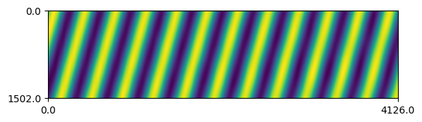
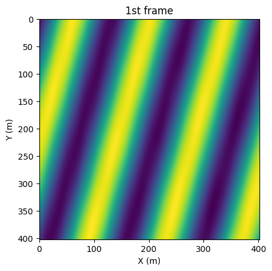
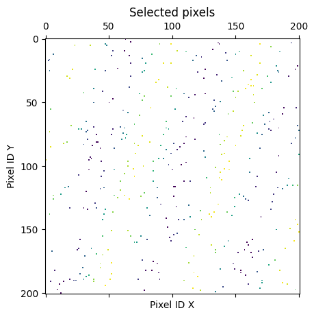
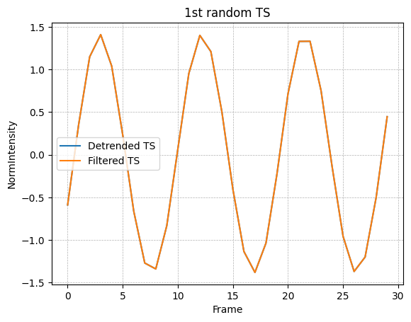
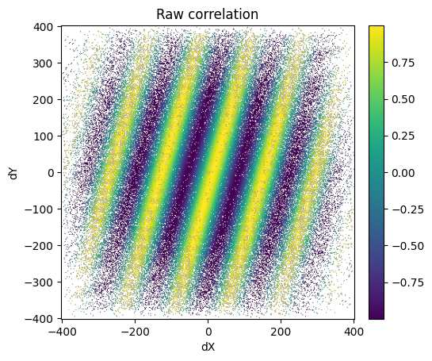
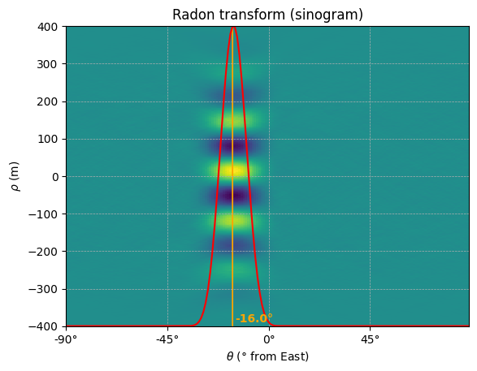
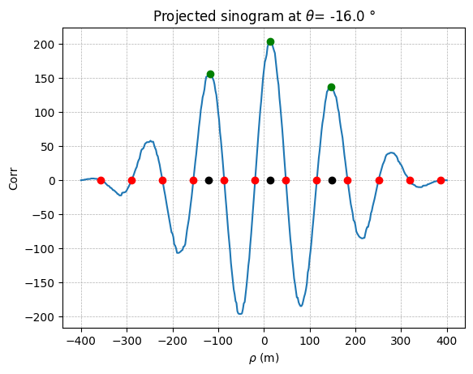

.. code:: ipython3

    %load_ext autoreload
    %autoreload 2

.. code:: ipython3

    from pathlib import Path
    from typing import Literal
    
    from matplotlib import pyplot as plt
    from mpl_toolkits.axes_grid1.inset_locator import inset_axes
    from shapely.geometry import Point
    from scipy.signal import find_peaks
    import numpy as np
    
    from s2shores.bathy_debug.temporal_correlation_bathy_estimator_debug import TemporalCorrelationBathyEstimatorDebug
    from s2shores.bathy_physics import wavelength_offshore
    from s2shores.generic_utils.image_filters import (
        circular_masking,
        clipping,
        detrend,
        gaussian_masking,
        normalise,
    )
    from s2shores.generic_utils.signal_filters import (
        butter_bandpass_filter,
        detrend_signal,
        filter_median,
    )
    from s2shores.generic_utils.signal_utils import find_period_from_zeros
    from s2shores.generic_utils.symmetric_radon import symmetric_radon
    from s2shores.image_processing.waves_radon import WavesRadon
    from s2shores.image_processing.waves_sinogram import WavesSinogram
    from s2shores.global_bathymetry.bathy_config import (
        BathyConfig,
        GlobalEstimatorConfig,
        TemporalCorrelationConfig,
        TemporalCorrelationTuningConfig,
    )
    from s2shores.waves_exceptions import WavesEstimationError, NotExploitableSinogram, SequenceImagesError
    from utils import initialize_sequential_run, read_config, build_ortho_sequence

In case of a specfic server setup, specify the paths for
~~~~~~~~~~~~~~~~~~~~~~~~~~~~~~~~~~~~~~~~~~~~~~~~~~~~~~~~

.. code:: python

   - os.environ["PROJ_DATA"]
   - os.environ["GDAL_DATA"]
   - os.environ["GDAL_DRIVER_PATH"]
   - os.environ["CONDA_PREFIX"]

.. code:: ipython3

    """
    import os
    os.environ["PROJ_DATA"]="..../share/proj"
    os.environ["GDAL_DATA"]="..../share/gdal"
    os.environ["GDAL_DRIVER_PATH"]="..../lib/gdalplugins"
    os.environ["CONDA_PREFIX"]="..../s2shores"
    """

Coastal Bathymetry Estimation via Temporal Correlation
------------------------------------------------------

| This notebook implements a bathymetric method using satellite imagery
  based on **temporal correlation** and the **linear relationship
  between water depth and wave kinematics**.
| Wave kinematics are inferred through the **temporal correlation of the
  wave field**, measured from a set of satellite images acquired within
  a short time interval.
| By leveraging the theory of linear wave dispersion in shallow water,
  bathymetry can be estimated from the wavelength of the waves.

Notebook Objective
------------------

This notebook provides an **experimental and interactive** environment
to: - explore and adjust the key processing steps, - quickly test
different parameters and method variations, - support **iterative
development** of the processing workflow in a prototyping context.

Notebook Summary
----------------

1. **Center point is out**: Check that the center pixel is inside the
   window.
2. **Preprocess the images**: Apply filters on the images.
3. **Create the sequence time series**: Pick random pixel positions and
   build the time series using all the images.
4. **Compute the temporal correlation**: Compute the temporal
   correlation and apply filters on it.
5. **Compute the Radon transform**: Compute Radon transforms and find
   the maximum of variance to determine direction.
6. **Compute the wavelength**: Compute the wavelength of the waves based
   on the sinogram of the determined direction.
7. **Compute the distances**: Compute the depth estimation.

.. code:: ipython3

    base_path = Path("../tests/data/products").resolve()
    test_case: Literal["7_4", "8_2"] = "7_4"
    method: Literal["spatial_corr", "spatial_dft", "temporal_corr"] = "temporal_corr"
    
    product_path: Path = base_path / "products" / f"SWASH_{test_case}/testcase_{test_case}.tif"
    config_path: Path = base_path / f"reference_results/debug_pointswash_{method}/wave_bathy_inversion_config.yaml"
    debug_file: Path = base_path / f"debug_points/debug_points_SWASH_{test_case}.yaml"

.. code:: ipython3

    # config = read_config(config_path=config_path)
    
    # OR
    
    config = BathyConfig(
        GLOBAL_ESTIMATOR=GlobalEstimatorConfig(
            WAVE_EST_METHOD='TEMPORAL_CORRELATION',
            SELECTED_FRAMES=None,
            OUTPUT_FORMAT='POINT',
            DXP=50.0,
            DYP=500.0,
            LAYERS_TYPE='EXPERT',
            NKEEP=5,
            OFFSHORE_LIMIT=100.0,
            WINDOW=400.0,
            SM_LENGTH=100,
            MIN_D=2.0,
            MIN_T=3.0,
            MAX_T=25.0,
            MIN_WAVES_LINEARITY=0.01,
            MAX_WAVES_LINEARITY=1.0,
            DEPTH_EST_METHOD='LINEAR',
        ),
        TEMPORAL_CORRELATION=TemporalCorrelationConfig(
            TEMPORAL_LAG=1,
            PERCENTAGE_POINTS=1.0,
            TUNING=TemporalCorrelationTuningConfig(
                DETREND_TIME_SERIES=0,
                FILTER_TIME_SERIES=0,
                LOWCUT_PERIOD=25.0,
                HIGHCUT_PERIOD=5.0,
                PEAK_DETECTION_HEIGHT_RATIO=0.3,
                PEAK_DETECTION_DISTANCE_RATIO=0.5,
                RATIO_SIZE_CORRELATION=1.0,
                MEDIAN_FILTER_KERNEL_RATIO_SINOGRAM=0.25,
                MEAN_FILTER_KERNEL_SIZE_SINOGRAM=5,
                SIGMA_CORRELATION_MASK=2.0,
                MEDIAN_FILTER_KERNEL=5,
            )
        )
    )

If you want to change any parameter of the configuration, modify the
values of the object ``config`` by overriding the values of the
attributes.

Example:

.. code:: python

   config.parameter = "new_value"

.. code:: ipython3

    bathy_estimator, ortho_bathy_estimator = initialize_sequential_run(
        product_path=product_path,
        config=config,
        delta_time_provider=None,
    )

.. parsed-literal::

    /home/geoffrey/miniconda3/envs/s2shores_env/lib/python3.12/site-packages/distributed/node.py:187: UserWarning: Port 8787 is already in use.
    Perhaps you already have a cluster running?
    Hosting the HTTP server on port 43461 instead
      warnings.warn(
    /home/geoffrey/miniconda3/envs/s2shores_env/lib/python3.12/site-packages/osgeo/gdal.py:312: FutureWarning: Neither gdal.UseExceptions() nor gdal.DontUseExceptions() has been explicitly called. In GDAL 4.0, exceptions will be enabled by default.
      warnings.warn(

.. code:: ipython3

    estimation_point = Point(451.0, 499.0)

.. code:: ipython3

    ortho_sequence = build_ortho_sequence(ortho_bathy_estimator, estimation_point)
    local_estimator = TemporalCorrelationBathyEstimatorDebug(
        estimation_point,
        ortho_sequence,
        bathy_estimator,
    )
    
    if not local_estimator.can_estimate_bathy():
        raise WavesEstimationError("Cannot estimate bathy.")

.. parsed-literal::

    <Figure size 900x1400 with 0 Axes>

Center point is out
-------------------

.. code:: ipython3

    if False:
        local_estimator.center_pt_is_out()
    else:
        merge_array = np.dstack([image.pixels for image in ortho_sequence])
        shape_y, shape_x = ortho_sequence.shape
        ts_mean = np.mean(merge_array[shape_y // 2, shape_x // 2, :])
    
        if not(np.isfinite(ts_mean)) or ts_mean == 0:
            raise SequenceImagesError('Window center pixel is out of border or has a 0 mean.')

Preprocess images
-----------------

Modified attributes: - local_estimator.ortho_sequence.<elements>.pixels

.. code:: ipython3

    def custom_filter(img, param1, param2):
        """My custom filter."""
        return img
    
    if False:
        local_estimator.preprocess_images()
    else:
        preprocessing_filters = [
            (normalise, []),
            # Add your custom filters here
            # Ex: (custom_filter, [param1, param2])
        ]
    
        for image in local_estimator.ortho_sequence:
            filtered_image = image.apply_filters(preprocessing_filters)
            image.pixels = filtered_image.pixels
        
    local_estimator.build_first_frame_plot()
    plt.show()

Create sequence time series
---------------------------

New attributes:

.. code:: python

   - local_estimator._time_series
   - local_estimator.metrics["detrend_time_series"]
   - local_estimator.metrics["filtered_time_series"]

.. code:: ipython3

    if False:
        local_estimator.create_sequence_time_series()
    else:
        percentage_points = config.TEMPORAL_CORRELATION.PERCENTAGE_POINTS
        if percentage_points < 0 or percentage_points > 100:
            raise ValueError('Percentage must be between 0 and 100')
    
        # Create frame stack
        merge_array = np.dstack([image.pixels for image in ortho_sequence])
    
        # Select pixel positions randomly
        shape_y, shape_x = ortho_sequence.shape
        image_size = shape_x * shape_y
        local_estimator._time_series = np.reshape(merge_array, (image_size, -1))
        np.random.seed(0)  # A seed is used here to reproduce same results
        nb_random_points = round(image_size * percentage_points / 100)
        random_indexes = np.random.randint(image_size, size=nb_random_points)
    
        sampling_positions_x, sampling_positions_y = np.unravel_index(
            random_indexes, ortho_sequence.shape)
        local_estimator._sampling_positions = (np.reshape(sampling_positions_x, (1, -1)),
                                    np.reshape(sampling_positions_y, (1, -1)))
    
        # Extract and detrend Time-series
        if config.TEMPORAL_CORRELATION.TUNING.DETREND_TIME_SERIES == 1:
            try:
                time_series_selec = detrend_signal(local_estimator._time_series[random_indexes, :], axis=1)
            except ValueError as excp:
                raise SequenceImagesError(
                    'Time-series can not be computed because of the presence of nans') from excp
        elif config.TEMPORAL_CORRELATION.TUNING.DETREND_TIME_SERIES == 0:
            time_series_selec = local_estimator._time_series[random_indexes, :]
        else:
            raise ValueError('DETREND_TIME_SERIES parameter must be 0 or 1.')
    
        # BP filtering
        if config.TEMPORAL_CORRELATION.TUNING.FILTER_TIME_SERIES == 1:
            fps = 1 / local_estimator.sampling_period
            local_estimator._time_series = butter_bandpass_filter(
                time_series_selec,
                lowcut_period=config.TEMPORAL_CORRELATION.TUNING.LOWCUT_PERIOD,
                highcut_period=config.TEMPORAL_CORRELATION.TUNING.HIGHCUT_PERIOD,
                sampling_freq=fps,
                axis=1)
        elif config.TEMPORAL_CORRELATION.TUNING.FILTER_TIME_SERIES == 0:
            local_estimator._time_series = time_series_selec
        else:
            raise ValueError('FILTER_TIME_SERIES parameter must be 0 or 1.')
    
    
        local_estimator.metrics['detrend_time_series'] = time_series_selec[0, :]
        local_estimator.metrics['filtered_time_series'] = local_estimator._time_series[0, :]
    
    
    local_estimator.build_first_frame_selection_plot()
    plt.show()

.. code:: ipython3

    local_estimator.build_first_TS_plot()
    plt.show()

Compute temporal correlation
----------------------------

New attributes:

.. code:: python

   - local_estimator.sinogram_maxvar
   - local_estimator.metrics["corr_indices_x"]
   - local_estimator.metrics["corr_indices_y"]
   - local_estimator.metrics["projected_corr_raw"]
   - local_estimator.metrics["corr_radon_input"]

New variables: - correlation_image

.. code:: ipython3

    import pandas
    from s2shores.image_processing.waves_image import WavesImage
    
    indices_x = np.round(local_estimator.distances * np.cos(local_estimator.angles))
    indices_x = np.array(indices_x - np.min(indices_x), dtype=int).T
    
    indices_y = np.round(local_estimator.distances * np.sin(local_estimator.angles))
    indices_y = np.array(indices_y - np.min(indices_y), dtype=int).T
    
    # if two correlation values have same xr and yr mean of these values is taken
    dataframe = pandas.DataFrame({
        'xr': indices_x.flatten(),
        'yr': indices_y.flatten(),
        'values': local_estimator.correlation_matrix.flatten(),
    })
    dataframe_grouped = dataframe.groupby(by=['xr', 'yr']).mean().reset_index()
    values = dataframe_grouped['values'].values
    indices_x = dataframe_grouped['xr'].values
    indices_y = dataframe_grouped['yr'].values
    
    projected_matrix = np.nanmean(local_estimator.correlation_matrix) * np.ones(
        (np.max(indices_x) + 1, np.max(indices_y) + 1))
    projected_matrix[indices_x, indices_y] = values
    
    local_estimator.metrics['corr_indices_x'] = indices_x
    local_estimator.metrics['corr_indices_y'] = indices_y
    local_estimator.metrics['projected_corr_raw'] = projected_matrix
    
    correlation_image = WavesImage(projected_matrix, local_estimator.spatial_resolution)
    plt.show()

Plot correlation matrix
-----------------------

.. code:: ipython3

    if False:
        local_estimator.build_correlation_matrix_plot()
    else:
        correlation_raw = local_estimator.metrics['projected_corr_raw']
    
        # Create the condition to select specific positions
        indices_x = local_estimator.metrics['corr_indices_x']
        indices_y = local_estimator.metrics['corr_indices_y']
        condition = np.zeros_like(correlation_raw, dtype=bool)
        condition[indices_x, indices_y] = True
    
        # Retrieve correlation spatial shape in meters
        spatial_res = local_estimator.metrics['spatial_resolution']
        wind_shape = local_estimator.ortho_sequence[0].pixels.shape
        x_spatial_limits = np.array([-(wind_shape[1]), wind_shape[1]]) * spatial_res
        y_spatial_limits = np.array([-(wind_shape[0]), wind_shape[0]]) * spatial_res
    
        # Plot
        image_plot = plt.imshow(
            np.where(
                condition,
                correlation_raw,
                np.nan),
            extent=[
                x_spatial_limits[0],
                x_spatial_limits[1],
                y_spatial_limits[0],
                y_spatial_limits[1]])
        plt.title('Raw correlation')
        plt.xlabel('dX')
        plt.ylabel('dY')
        # create an axis for the colorbar
        axins = inset_axes(image_plot.axes,
                            width='5%',
                            height='100%',
                            loc='lower left',
                            bbox_to_anchor=(1.05, 0., 1, 1),
                            bbox_transform=image_plot.axes.transAxes,
                            borderpad=0)
        plt.colorbar(image_plot, cax=axins)

Apply Correlation filters
-------------------------

New attributes:

.. code:: python

   - local_estimator.metrics["corr_radon_input"]

Modified variables: - correlation_image

.. code:: ipython3

    def custom_filter(array, param1, param2):
        # Implement your filter here
        return array
    
    if False:
        local_estimator.compute_temporal_correlation()
        correlation_image = local_estimator.correlation_image
    else:
        correlation_image_filters = [
            (detrend, []),
            (gaussian_masking, [config.TEMPORAL_CORRELATION.TUNING.SIGMA_CORRELATION_MASK]),
            (clipping, [config.TEMPORAL_CORRELATION.TUNING.RATIO_SIZE_CORRELATION]),
            # Add your custom filters here
            # Ex: (custom_filter, [param1, param2])
        ]
    
        correlation_image = correlation_image.apply_filters(correlation_image_filters)
    
    local_estimator.metrics['corr_radon_input'] = correlation_image.pixels
    local_estimator.build_correlation_matrix_filled_filtered()
    plt.show()

.. image:: temporal_correlation_files/temporal_correlation_23_0.png

Compute radon transform
-----------------------

New attributes:

.. code:: python

   - local_estimator.sinogram_maxvar
   - local_estimator.metrics["radon_transform"]
   - local_estimator.metrics["variances"]
   - local_estimator.metrics["direction"]
   - local_estimator.metrics["sinogram_max_var"]

New variables: - direction_propagation

.. code:: ipython3

    if False:
        direction_propagation = local_estimator.compute_radon_transform()
    else:
        # Start: WavesRadon(local_estimator.correlation_image, local_estimator.selected_directions)
        sampling_frequency = 1. / correlation_image.resolution
    
        pixels = circular_masking(correlation_image.pixels.copy())
        radon_transform = symmetric_radon(image=pixels, theta=local_estimator.selected_directions)
    
        local_estimator.radon_transform = {
            direction: radon_transform[:, idx]
            for idx, direction in enumerate(local_estimator.selected_directions)
        }
        # End: WavesRadon(local_estimator.correlation_image, local_estimator.selected_directions)
    
        # Start: WavesRadon.get_direction_maximum_variance()
    
        # Start: Sinograms.get_sinograms_variances(selected_directions)
        variances = np.empty(len(local_estimator.selected_directions), dtype=np.float64)
        for result_index, direction in enumerate(local_estimator.selected_directions):
            variances[result_index] = float(np.var(local_estimator.radon_transform[direction]))
        # End: Sinograms.get_sinograms_variances
    
        index_max_variance = np.argmax(variances)
        direction_propagation = local_estimator.selected_directions[index_max_variance]
        # End: WavesRadon.get_direction_maximum_variance
    
        # Extract projected sinogram at max var ang from sinogram
        sinogram_maxvar = local_estimator.radon_transform[direction_propagation]
    
    
        # Median filtering of the projected sinogram
        sinogram_max_var_filters = [
            (filter_median, [config.TEMPORAL_CORRELATION.TUNING.MEDIAN_FILTER_KERNEL]),
        ]
    
        for filter, filter_params in sinogram_max_var_filters:
            sinogram_maxvar = filter(sinogram_maxvar, *filter_params)
    
        local_estimator.sinogram_maxvar = WavesSinogram(sinogram_maxvar)
        local_estimator.metrics['radon_transform'] = WavesRadon(correlation_image, local_estimator.selected_directions)
        local_estimator.metrics['variances'] = variances
        local_estimator.metrics['direction'] = direction_propagation
        local_estimator.metrics['sinogram_max_var'] = sinogram_maxvar

Plot radon matrix
-----------------

.. code:: ipython3

    # Import sinogram
    radon_array, _ = local_estimator.metrics['radon_transform'].get_as_arrays()
    
    # Retrieve rho axis of radon transform
    nb_rho, _ = radon_array.shape
    spatial_res = local_estimator.metrics['spatial_resolution']
    y_spatial_limits = np.array([-(nb_rho // 2), nb_rho // 2]) * spatial_res
    
    # Import directions
    directions = local_estimator.selected_directions
    min_dir = np.min(directions)
    max_dir = np.max(directions)
    ang_ticks = np.arange(min_dir, max_dir + 2, 45)
    ang_labels = ['{:.0f}'.format(ang) + u'\N{DEGREE SIGN}' for ang in ang_ticks]
    
    # Plot
    image_plot = plt.imshow(radon_array,
                interpolation='nearest',
                aspect='auto',
                origin='lower',
                extent=[min_dir, max_dir, y_spatial_limits[0], y_spatial_limits[1]]
                )
    plt.plot(
        local_estimator.selected_directions,
        (
            (local_estimator._metrics['variances'] / np.max(local_estimator._metrics['variances']))
            * (nb_rho - 1)
            * spatial_res
        ) + y_spatial_limits[0],
        'r',
    )
    plt.title('Radon transform (sinogram)')
    plt.xticks(ticks=ang_ticks, labels=ang_labels)
    plt.grid(True, linestyle='--', linewidth=0.5)
    plt.xlabel(r'$\theta$ (' + u'\N{DEGREE SIGN} from East)')
    plt.ylabel(r'$\rho$ (m)')
    
    # Highlight max var angle corresponding to wave direction
    if 'direction' in local_estimator.metrics:
        plt.arrow(
            local_estimator.metrics['direction'],
            y_spatial_limits[0],
            0,
            (nb_rho - 2) * spatial_res,
            color='orange')
        plt.annotate(f"{local_estimator.metrics['direction']}°",
                        (local_estimator.metrics['direction'] + 1, 10 + y_spatial_limits[0]),
                        color='orange',
                        fontweight='bold'
                        )

Compute wavelength
------------------

New attributes:

.. code:: python

   - local_estimator.metrics["wave_spatial_zeros"]

New variables: - wavelength - wavelength_zeros

.. code:: ipython3

    if False:
        wavelength, wavelength_zeros = local_estimator.compute_wavelength()
    else:
        min_wavelength = wavelength_offshore(local_estimator.global_estimator.waves_period_min, local_estimator.gravity)
        try:
            period, wavelength_zeros = find_period_from_zeros(
                sinogram_maxvar,
                int(min_wavelength / local_estimator.spatial_resolution),
            )
        except ValueError as excp:
            raise NotExploitableSinogram('Wave length can not be computed from sinogram') from excp
        wavelength = period * local_estimator.spatial_resolution
    
        local_estimator.metrics['wave_spatial_zeros'] = wavelength_zeros * local_estimator.spatial_resolution
    
    wavelength

.. parsed-literal::

    134.9612762034624

Compute distances
-----------------

New attributes:

.. code:: python

   - local_estimator.metrics["max_indices"]
   - local_estimator.metrics["wave_distance"]

New variables: - distances

.. code:: ipython3

    if False:
        distances = local_estimator.compute_distance(wavelength, wavelength_zeros)
    else:
        x_axis = np.arange(0, len(sinogram_maxvar)) - (len(sinogram_maxvar) // 2)
        period = int(wavelength / local_estimator.spatial_resolution)
        max_sinogram = np.max(sinogram_maxvar[(x_axis >= wavelength_zeros[0]) & (x_axis < wavelength_zeros[-1])])
    
        # Find peaks
        tuning_parameters = local_estimator.local_estimator_params['TUNING']
        peaks, _ = find_peaks(
            sinogram_maxvar[(x_axis >= wavelength_zeros[0]) & (x_axis < wavelength_zeros[-1])],
            height=tuning_parameters['PEAK_DETECTION_HEIGHT_RATIO'] *
            max_sinogram,
            distance=tuning_parameters['PEAK_DETECTION_DISTANCE_RATIO'] * period,
        )
    
        # Compute initial distance
        dx_in_list = x_axis[(x_axis >= wavelength_zeros[0]) & (x_axis < wavelength_zeros[-1])][peaks]
        distances = []
    
        for dx_in in dx_in_list:
            # Find 0-crossing surrounding the peak
            zeros_right = wavelength_zeros[wavelength_zeros > dx_in][0]
            zeros_left = wavelength_zeros[wavelength_zeros <= dx_in][-1]
    
            # Refine distance
            ref = [zeros_right, zeros_left][np.argmin(np.abs([zeros_right, zeros_left]))]
            offset = np.sign(dx_in - ref) * (np.abs(zeros_left - zeros_right) / 2)
            distance = ref + offset
            distances.append(distance)
    
        # Distance of the wave propagation
        distances = np.array(distances) * local_estimator.spatial_resolution
    
        local_estimator.metrics['max_indices'] = peaks
        local_estimator.metrics['wave_distance'] = distances

Plot projected sinogram at max variance
---------------------------------------

.. code:: ipython3

    sinogram_max_var = local_estimator.metrics['sinogram_max_var']
    
    # Retreive axis of the sinogram value plot
    spatial_res = local_estimator.metrics['spatial_resolution']
    x_spatial_axis = (
        np.arange(0, len(sinogram_max_var))
        - (len(sinogram_max_var) // 2)
    ) * spatial_res
    
    # Import zeros and max detections
    zeros = local_estimator.metrics['wave_spatial_zeros']
    max_indices = local_estimator.metrics['max_indices']
    dx = local_estimator.metrics['wave_distance']
    
    # Plot
    lines = plt.plot(x_spatial_axis, sinogram_max_var)
    lines += plt.plot(zeros, np.zeros((len(zeros))), 'ro')
    lines += plt.plot(
        x_spatial_axis[(x_spatial_axis >= zeros[0]) & (x_spatial_axis < zeros[-1])][max_indices],
        sinogram_max_var[
            (x_spatial_axis >= zeros[0]) & (x_spatial_axis < zeros[-1])][max_indices],
        'go',
    )
    lines += plt.plot(dx, np.zeros(len(dx)), 'ko')
    plt.title(r'Projected sinogram at $\theta$= {:.1f} °'.format(local_estimator.metrics['direction']))
    plt.xlabel(r'$\rho$ (m)')
    plt.ylabel('Corr')
    plt.grid(True, linestyle='--', linewidth=0.5)

Save wave field estimation
--------------------------

New elements: - local_estimator.bathymetry_estimations

.. code:: ipython3

    if False:
        local_estimator.save_wave_field_estimation(direction_propagation, wavelength, distances)
    else:
        for i, distance in enumerate(distances):
            bathymetry_estimation = local_estimator.create_bathymetry_estimation(
                direction_propagation,
                wavelength,
            )
            bathymetry_estimation.delta_position = distance
            local_estimator.bathymetry_estimations.append(bathymetry_estimation)
    
            print(
                f"\033[4mDistance n°{i}:\033[0m",
                f"Physical: {bathymetry_estimation.is_physical()}",
                bathymetry_estimation,
                "\n",
                sep="\n",
            )
    
        local_estimator.bathymetry_estimations.sort_on_attribute('linearity', reverse=False)
    
        local_estimator.metrics['bathymetry_estimation'] = local_estimator.bathymetry_estimations
        local_estimator.metrics['status'] = local_estimator.bathymetry_estimations.status

.. parsed-literal::

    Distance n°0:
    Physical: False
    Geometry:   direction: 164.0° wavelength: 134.96 (m) wavenumber: 0.007410 (m-1)
    Dynamics:   period:  1.12 (s)  celerity: 120.46 (m/s)
    Wave Field Estimation: 
      delta time: 1.000 (s) stroboscopic factor: 0.893 (unitless)
      delta position: 120.46 (m)  delta phase:  5.61 (rd)
    Bathymetry inversion: depth:   inf (m)  gamma: 69.080  offshore period:  9.31 (s)  shallow water period: 30.52 (s)  relative period:  8.31  relative wavelength:  0.01  gravity: 9.780 (s) 
    Bathymetry Estimation:  stroboscopic factor low depth: 0.033  stroboscopic factor offshore: 0.107 
    
    
    Distance n°1:
    Physical: True
    Geometry:   direction: -16.0° wavelength: 134.96 (m) wavenumber: 0.007410 (m-1)
    Dynamics:   period:  9.34 (s)  celerity: 14.44 (m/s)
    Wave Field Estimation: 
      delta time: 1.000 (s) stroboscopic factor: 0.107 (unitless)
      delta position: 14.44 (m)  delta phase:  0.67 (rd)
    Bathymetry inversion: depth: 60.70 (m)  gamma: 0.993  offshore period:  9.31 (s)  shallow water period: 30.52 (s)  relative period:  1.00  relative wavelength:  1.01  gravity: 9.780 (s) 
    Bathymetry Estimation:  stroboscopic factor low depth: 0.033  stroboscopic factor offshore: 0.107 
    
    
    Distance n°2:
    Physical: False
    Geometry:   direction: -16.0° wavelength: 134.96 (m) wavenumber: 0.007410 (m-1)
    Dynamics:   period:  0.90 (s)  celerity: 149.36 (m/s)
    Wave Field Estimation: 
      delta time: 1.000 (s) stroboscopic factor: 1.107 (unitless)
      delta position: 149.36 (m)  delta phase:  6.95 (rd)
    Bathymetry inversion: depth:   inf (m)  gamma: 106.191  offshore period:  9.31 (s)  shallow water period: 30.52 (s)  relative period: 10.30  relative wavelength:  0.01  gravity: 9.780 (s) 
    Bathymetry Estimation:  stroboscopic factor low depth: 0.033  stroboscopic factor offshore: 0.107 
    
    

